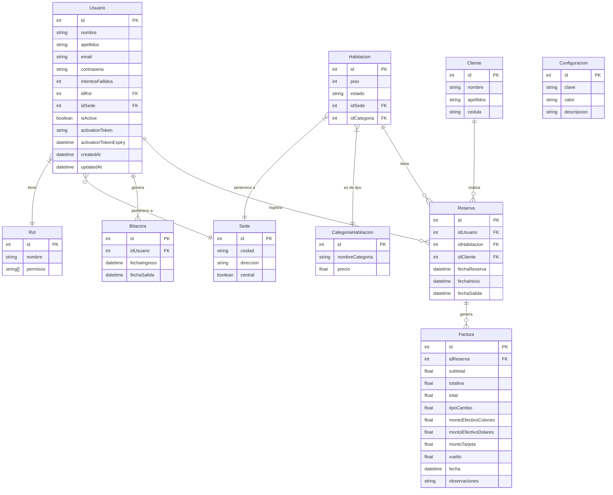
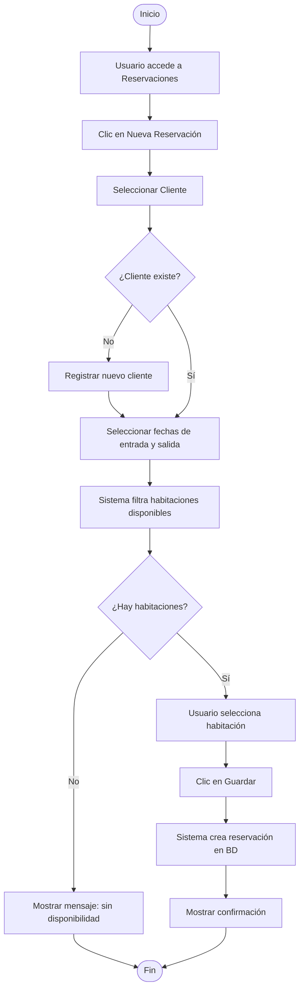
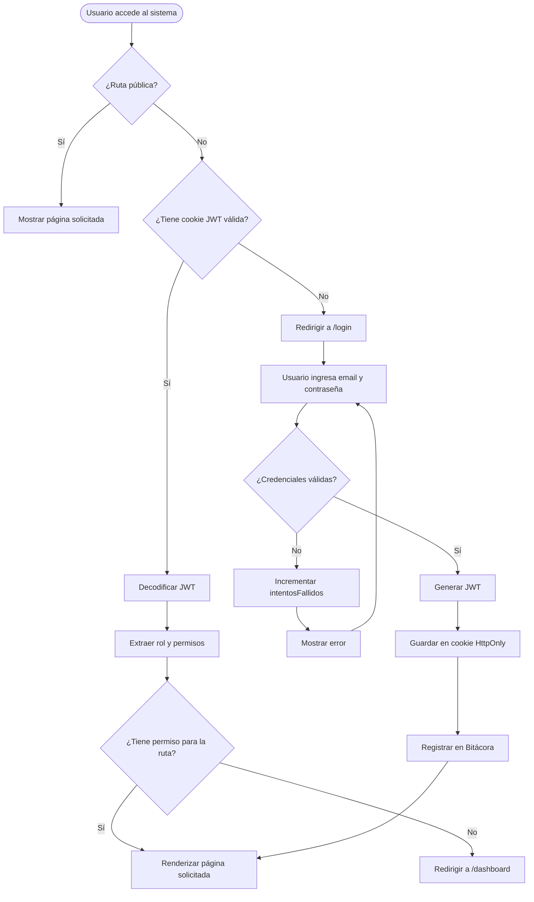
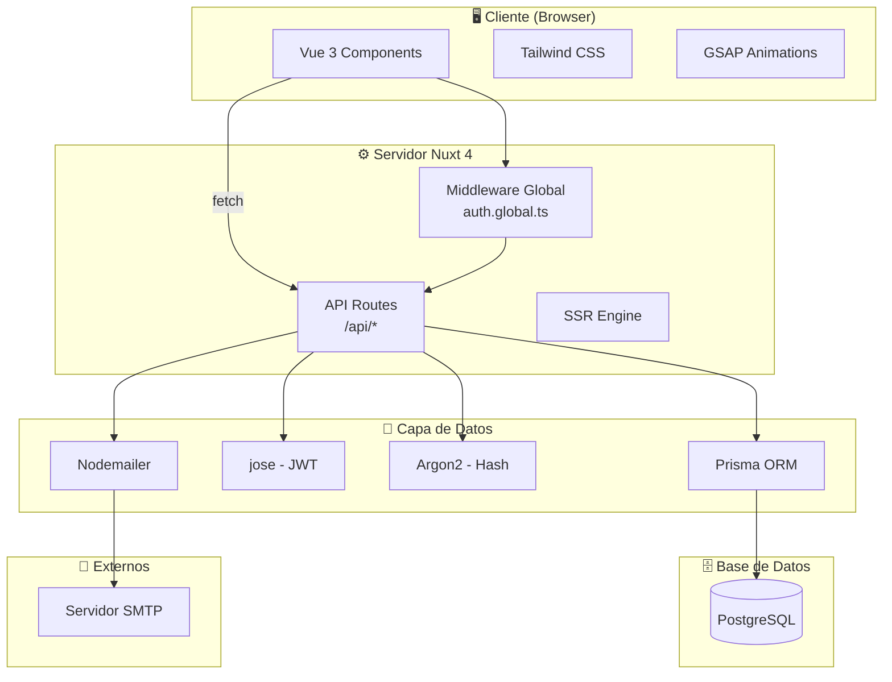
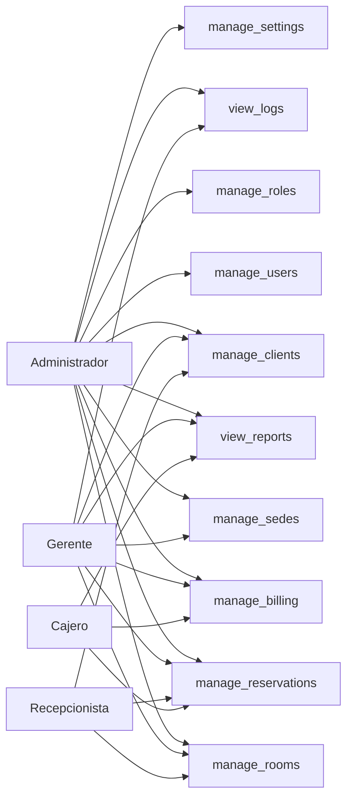

# 📋 Documento de Requerimientos — ERP Hotel

**Sistema de Gestión Hotelera** | Versión 1.0 | Abril 2026

---

## Tabla de Contenidos

1. [Introducción](#1-introducción)
2. [Alcance del Sistema](#2-alcance-del-sistema)
3. [Stakeholders](#3-stakeholders)
4. [Requerimientos Funcionales](#4-requerimientos-funcionales)
5. [Requerimientos No Funcionales](#5-requerimientos-no-funcionales)
6. [Casos de Uso](#6-casos-de-uso)
7. [Diagrama de Casos de Uso](#7-diagrama-de-casos-de-uso)
8. [Diagrama Entidad-Relación](#8-diagrama-entidad-relación)
9. [Diagrama de Flujo — Reservación](#9-diagrama-de-flujo--reservación)
10. [Diagrama de Flujo — Autenticación](#10-diagrama-de-flujo--autenticación)
11. [Diagrama de Arquitectura](#11-diagrama-de-arquitectura)
12. [Modelo de Roles y Permisos](#12-modelo-de-roles-y-permisos)
13. [Restricciones y Supuestos](#13-restricciones-y-supuestos)

---

## 1. Introducción

### 1.1 Propósito

Este documento describe los requerimientos funcionales y no funcionales del sistema **ERP Hotel**, una aplicación web integral para la administración de operaciones hoteleras multi-sede. Define el alcance, los actores del sistema, los casos de uso y los modelos de datos que guían su desarrollo.

### 1.2 Definiciones y Siglas

| Término | Definición |
|---|---|
| ERP | Enterprise Resource Planning — Sistema de planificación de recursos empresariales |
| RBAC | Role-Based Access Control — Control de acceso basado en roles |
| JWT | JSON Web Token — Token de autenticación |
| SSR | Server-Side Rendering — Renderizado en el servidor |
| ORM | Object-Relational Mapping |
| IVA | Impuesto al Valor Agregado |
| CRC | Colón Costarricense (₡) |
| USD | Dólar estadounidense ($) |
| Sede | Sucursal o establecimiento del hotel |

---

## 2. Alcance del Sistema

El sistema cubre los siguientes módulos operacionales:

- ✅ Autenticación y gestión de sesiones
- ✅ Control de acceso por roles y permisos
- ✅ Gestión de usuarios del sistema
- ✅ Gestión de sedes (sucursales)
- ✅ Gestión de habitaciones y categorías
- ✅ Registro y gestión de clientes
- ✅ Creación y control de reservaciones
- ✅ Emisión de facturas con múltiples métodos de pago
- ✅ Bitácora de accesos al sistema
- ✅ Reportes de ocupación e ingresos
- ✅ Configuración global del sistema
- ✅ Activación de cuentas por correo electrónico

**Fuera del alcance (v1.0):**
- ❌ Integración con sistemas de pago en línea
- ❌ Aplicación móvil nativa
- ❌ Sistema de inventario de amenidades
- ❌ Chat o mensajería interna

---

## 3. Stakeholders

| Rol | Descripción | Interés principal |
|---|---|---|
| **Gerente General** | Supervisa todas las operaciones | Reportes, visibilidad multi-sede |
| **Administrador del Sistema** | Configura y mantiene el sistema | Control total de usuarios y parámetros |
| **Recepcionista** | Atiende llegadas y salidas | Gestión ágil de reservaciones |
| **Cajero** | Procesa pagos | Facturación rápida y precisa |
| **Gerente de Sede** | Administra una sucursal | Operaciones de su sede |
| **Cliente del Hotel** | Huésped que se hospeda | No interactúa directamente con el sistema |

---

## 4. Requerimientos Funcionales

### RF-01: Autenticación de Usuarios
- El sistema debe permitir el inicio de sesión mediante correo electrónico y contraseña.
- Las contraseñas deben estar hasheadas con Argon2.
- Se debe registrar el número de intentos fallidos de inicio de sesión.
- Las sesiones se gestionan mediante JWT almacenados en cookies HttpOnly.

### RF-02: Activación de Cuentas
- Las cuentas nuevas deben activarse mediante un enlace enviado por correo electrónico.
- El enlace de activación debe tener fecha de expiración.
- El usuario debe establecer su contraseña durante la activación.

### RF-03: Gestión de Usuarios
- El sistema debe permitir crear, editar, listar y eliminar usuarios.
- Cada usuario tiene un rol asignado y opcionalmente una sede.
- Solo administradores y gerentes pueden gestionar usuarios.

### RF-04: Control de Acceso por Roles
- El sistema debe restringir el acceso a módulos según el rol del usuario.
- Los permisos se almacenan como array en el modelo Rol.
- El middleware de autenticación debe ejecutarse en cada navegación.

### RF-05: Gestión de Sedes
- El sistema debe soportar múltiples sedes (sucursales).
- Cada sede tiene ciudad, dirección y puede ser marcada como sede central.
- Las habitaciones y usuarios se asocian a una sede específica.

### RF-06: Gestión de Habitaciones
- Las habitaciones tienen: piso, estado, sede y categoría.
- Los estados posibles son: disponible, ocupada, mantenimiento.
- Las categorías definen el tipo y precio de la habitación.

### RF-07: Gestión de Clientes
- El sistema debe permitir registrar clientes con: nombre, apellidos y cédula.
- La cédula debe ser única en el sistema.

### RF-08: Gestión de Reservaciones
- Se debe poder crear reservaciones indicando: cliente, habitación, fecha entrada y salida.
- El sistema debe mostrar solo habitaciones disponibles para las fechas seleccionadas.
- Se debe poder eliminar reservaciones.

### RF-09: Facturación
- El sistema debe emitir facturas asociadas a una reservación.
- Debe calcular automáticamente: subtotal, IVA y total.
- Debe aceptar pago en: efectivo CRC, efectivo USD y tarjeta.
- Debe calcular el vuelto automáticamente.
- Debe registrar el tipo de cambio al momento del pago.

### RF-10: Bitácora
- El sistema debe registrar automáticamente cada inicio y cierre de sesión.
- La bitácora debe ser visible para administradores y gerentes.

### RF-11: Reportes
- El sistema debe generar reportes de ocupación de habitaciones.
- El sistema debe generar reportes de ingresos por período.

### RF-12: Configuración del Sistema
- El sistema debe permitir gestionar parámetros clave-valor de configuración global.
- Solo administradores pueden modificar la configuración.

---

## 5. Requerimientos No Funcionales

### RNF-01: Rendimiento
- Las páginas deben cargar en menos de 3 segundos en condiciones normales.
- Las consultas a la base de datos deben optimizarse con índices apropiados.

### RNF-02: Seguridad
- Todas las comunicaciones deben realizarse por HTTPS en producción.
- Las cookies de sesión deben ser HttpOnly y SameSite.
- Las contraseñas no deben almacenarse en texto plano.
- El acceso a endpoints debe validarse en el servidor (no confiar solo en el frontend).

### RNF-03: Usabilidad
- La interfaz debe ser intuitiva y no requerir entrenamiento extenso.
- El sistema debe proveer retroalimentación visual para todas las acciones (toasts, modales).
- El diseño debe ser responsivo para tablets y escritorio.

### RNF-04: Disponibilidad
- El sistema debe tener una disponibilidad mínima del 99% en horario operativo.

### RNF-05: Escalabilidad
- La arquitectura debe soportar el crecimiento en número de sedes y usuarios sin refactorización mayor.

### RNF-06: Mantenibilidad
- El código debe estar organizado por módulos con separación de responsabilidades.
- Las variables de entorno deben externalizarse del código fuente.

### RNF-07: Compatibilidad
- Compatible con los navegadores: Chrome 110+, Firefox 110+, Edge 110+, Safari 16+.

---

## 6. Casos de Uso

### CU-01: Iniciar Sesión
- **Actor:** Todos los usuarios
- **Precondición:** El usuario existe y tiene cuenta activa
- **Flujo principal:**
  1. Usuario ingresa email y contraseña
  2. Sistema valida credenciales contra la BD
  3. Sistema genera JWT y lo almacena en cookie
  4. Sistema registra acceso en Bitácora
  5. Usuario es redirigido al Dashboard
- **Flujo alternativo:** Credenciales incorrectas → incrementa `intentosFallidos`

### CU-02: Crear Reservación
- **Actor:** Recepcionista, Administrador, Gerente
- **Precondición:** Existe al menos un cliente y una habitación disponible
- **Flujo principal:**
  1. Usuario selecciona cliente
  2. Usuario define fechas de entrada y salida
  3. Sistema filtra habitaciones disponibles
  4. Usuario selecciona habitación
  5. Sistema crea la reservación
- **Flujo alternativo:** No hay habitaciones disponibles → se notifica al usuario

### CU-03: Emitir Factura
- **Actor:** Cajero, Administrador, Gerente
- **Precondición:** Existe una reservación sin factura
- **Flujo principal:**
  1. Cajero selecciona la reservación
  2. Sistema calcula subtotal, IVA y total
  3. Cajero ingresa montos y método de pago
  4. Sistema calcula vuelto
  5. Sistema registra la factura

### CU-04: Crear Usuario
- **Actor:** Administrador, Gerente
- **Flujo principal:**
  1. Administrador completa el formulario de nuevo usuario
  2. Sistema crea el usuario con estado inactivo
  3. Sistema genera token de activación
  4. Sistema envía correo al nuevo usuario
  5. Usuario activa su cuenta y establece contraseña

### CU-05: Consultar Bitácora
- **Actor:** Administrador, Gerente
- **Flujo principal:**
  1. Usuario accede al módulo de Bitácora
  2. Sistema muestra historial de accesos con fechas y usuarios

---

## 7. Diagrama de Casos de Uso

```mermaid
graph TD
    Admin([Administrador])
    Gerente([Gerente])
    Recep([Recepcionista])
    Cajero([Cajero])

    Admin --> CU01[Iniciar Sesión]
    Admin --> CU04[Gestionar Usuarios]
    Admin --> CU05[Gestionar Roles]
    Admin --> CU06[Gestionar Sedes]
    Admin --> CU07[Ver Bitácora]
    Admin --> CU08[Configurar Sistema]
    Admin --> CU09[Ver Reportes]
    Admin --> CU02[Gestionar Reservaciones]
    Admin --> CU03[Emitir Factura]
    Admin --> CU10[Gestionar Habitaciones]

    Gerente --> CU01
    Gerente --> CU04
    Gerente --> CU06
    Gerente --> CU07
    Gerente --> CU09
    Gerente --> CU02
    Gerente --> CU03
    Gerente --> CU10

    Recep --> CU01
    Recep --> CU02
    Recep --> CU10

    Cajero --> CU01
    Cajero --> CU03
    Cajero --> CU09
```

---

## 8. Diagrama Entidad-Relación

---

## 9. Diagrama de Flujo — Reservación

---

## 10. Diagrama de Flujo — Autenticación

---

## 11. Diagrama de Arquitectura

---

## 12. Modelo de Roles y Permisos

### Roles predefinidos del sistema

### Tabla de permisos por módulo

| Permiso | Admin | Gerente | Recepcionista | Cajero |
|---|:---:|:---:|:---:|:---:|
| `manage_users` | ✅ | ⚠️ | ❌ | ❌ |
| `manage_roles` | ✅ | ❌ | ❌ | ❌ |
| `manage_sedes` | ✅ | ✅ | ❌ | ❌ |
| `manage_rooms` | ✅ | ✅ | ✅ | ❌ |
| `manage_reservations` | ✅ | ✅ | ✅ | ✅ |
| `manage_billing` | ✅ | ✅ | ❌ | ✅ |
| `view_reports` | ✅ | ✅ | ❌ | ✅ |
| `view_logs` | ✅ | ✅ | ❌ | ❌ |
| `manage_settings` | ✅ | ❌ | ❌ | ❌ |
| `manage_clients` | ✅ | ✅ | ✅ | ❌ |

> ⚠️ Gerente puede gestionar usuarios de su sede, no crear administradores.

---

## 13. Restricciones y Supuestos

### Restricciones

| # | Restricción |
|---|---|
| R1 | El sistema requiere conexión activa a internet para operar |
| R2 | La base de datos debe ser PostgreSQL 15 o superior |
| R3 | El servidor de correo SMTP debe estar configurado para el envío de emails |
| R4 | Los tokens JWT deben renovarse al expirar (el usuario debe volver a iniciar sesión) |
| R5 | Las facturas emitidas no pueden modificarse ni eliminarse |
| R6 | Un cliente no puede tener dos reservaciones activas para la misma habitación en fechas superpuestas |

### Supuestos

| # | Supuesto |
|---|---|
| S1 | Cada sede opera con la misma estructura de habitaciones y categorías |
| S2 | El tipo de cambio USD/CRC se ingresa manualmente en cada factura |
| S3 | El IVA aplicable es un parámetro configurable en el sistema |
| S4 | Existe al menos un administrador activo en el sistema en todo momento |
| S5 | Los usuarios tienen acceso a un correo electrónico válido para la activación |
| S6 | El sistema opera en zona horaria de Costa Rica (UTC-6) |

---

*Documento de Requerimientos — ERP Hotel v1.0 | Abril 2026*
